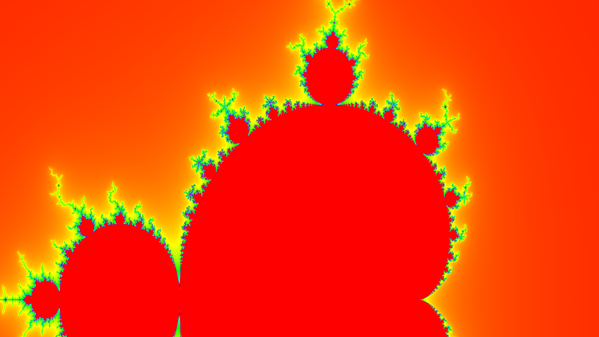

# Mendelbrot Renderer

This program creates a blank canvas and draws the points which belong to the _MendelBrot Set_ $\mathbf{M}$.

Specifically, a point $\mathbf{P}: (x, y)$ translates to a complex value of $c = x + \imath y$, without considering the traslation and scaling.

A point belongs to the Mendelbrot set if the series 
```math
  z_c(n) := \begin{cases} 0, & \text{if } n-1 = 0\\z_c(n-1)^2 + c, &\text{if } n-1 > 0\end{cases}
```
is bounded.
That is if:
```math
 c \in \mathbf{M} \iff k \in \mathbb{R^+} \land \forall n \in \mathbb{N}, |z_c(n)| \leq k 
``` 
# Computation

## Naive approach

A naive approach would consist in computing all the series of all the complex points in the canvas and color
the points in the canvas based on the value of $z_c(n)$ after a predetermined number of iterations.

## Early Escaping

Many of the points that are not in the _Mendelbrot Set_ have series that are unbounded and diverge to infinity very fast.
By leveraging this fact we can choose a tight bound $B$ for the value of $z_c(n)$ which, if crossed, interrupts the iterations.

## Recursive quadrants subdivision and pruning

A study from 1984 proves that there can't be isolated points that are in the _Mendelbrot Set_. By leveraging this fact we can
recursively subdivide the plane into quadrants, find the first quadrant with points in the mendelbrot set and then calculate only the
neighboring quadrants with which the current quadrant has active neighboring points (active means in the Mendelbrot Set).
Also, this imply that at the end we should also have understood the neighboring points for the super-quadrant comprising all 4 quadrants of the subdivision,
which will be returned to the previous recursion step.

# Example Image

